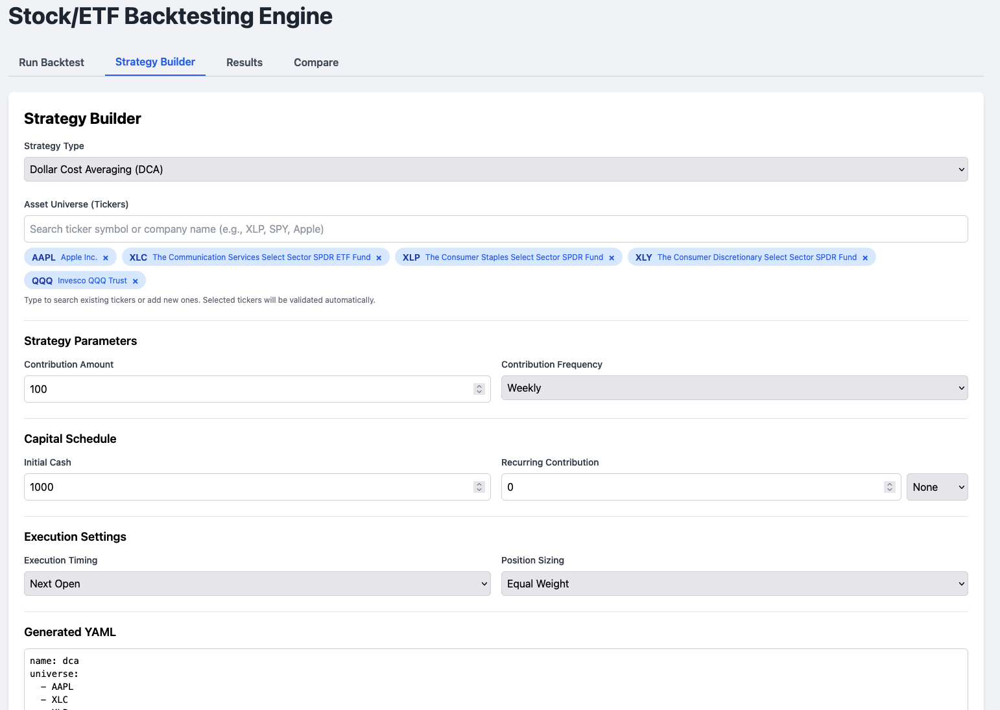
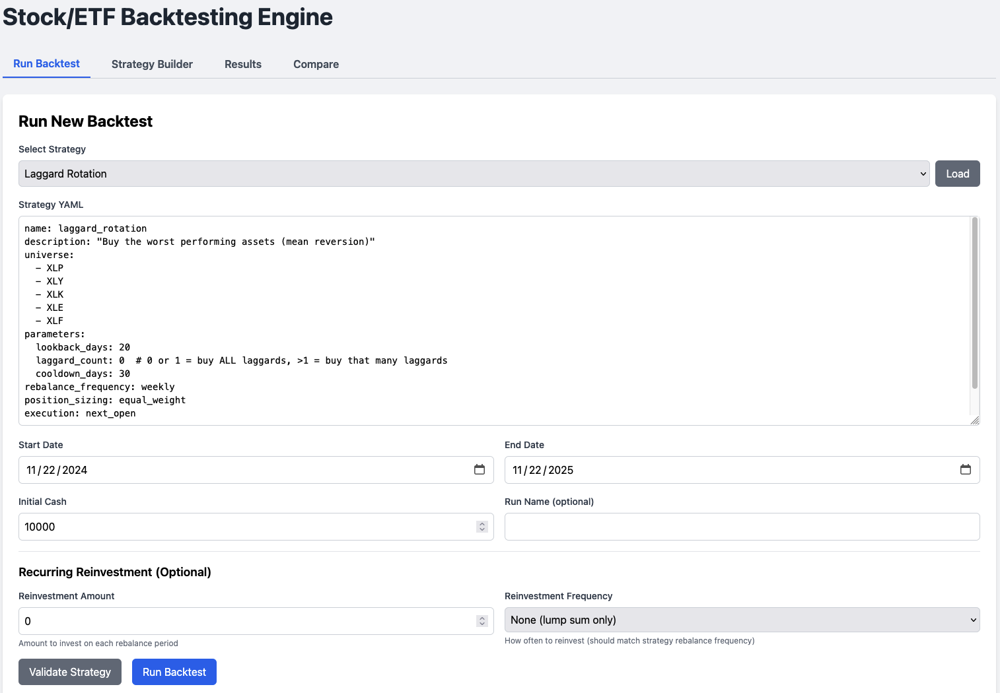

# BACKGENIE - Stock/ETF Backtesting Engine

> **Problem Statement**: I have money to invest now, and will continue to invest in the future. Should I just invest in index fund as many suggest or should I invest in a variety of funds/sectors/stocks? When should I rebalance? How can I know if my investing strategy makes sense?


**Solution**: A production-ready, local-first Python backtesting framework for building and testing algorithmic trading strategies. Perfect for developers, quants, and traders who need a flexible, extensible backtesting engine with a modern web interface.

## 🚀 Key Features

### Core Engine Capabilities
- **Modular Strategy Architecture**: Extensible base class system for implementing custom trading strategies
- **Multiple Execution Models**: Support for `next_open`, `same_day`, `first_day_only`, and `market_close` execution timing
- **Portfolio Simulation**: Full portfolio accounting with fractional shares, cash management, and position tracking
- **Recurring Contributions**: Built-in support for weekly/monthly reinvestments with configurable schedules
- **Equal Cash Allocation**: Automatic splitting of available cash across multiple buy orders
- **Trading Day Alignment**: Smart handling of market holidays and weekends using actual trading calendars

### Built-in Trading Strategies
- **Buy & Hold**: Baseline strategy for benchmarking
- **Dollar Cost Averaging (DCA)**: Systematic investing with regular contributions
- **Laggard Rotation**: Mean reversion strategy buying worst performers
- **Momentum Winner**: Trend-following strategy buying best performers
- **Mixed Winners/Losers**: Combination strategy buying both extremes
- **RSI Mean Reversion**: Technical indicator-based strategy (RSI oversold/overbought)

### Data & Analytics
- **Yahoo Finance Integration**: Automatic data fetching via `yfinance` with intelligent caching
- **SQLite Data Cache**: Persistent local storage for fast historical data access
- **Comprehensive Metrics**: CAGR, Sharpe ratio, Sortino ratio, max drawdown, win rate, volatility, profit factor, and more
- **QQQ Baseline Comparison**: Automatic comparison against QQQ with matching investment patterns
- **Rolling Metrics**: 30/60/90-day rolling window calculations

### Web Interface & Visualization
- **Interactive Dashboard**: Modern Flask + Tailwind CSS + Plotly web application
- **Strategy Builder UI**: Visual form-based strategy creation with type-ahead ticker search
- **YAML Editor**: Direct YAML editing with syntax validation
- **Results Visualization**: Interactive equity curves, drawdown charts, and trade history tables
- **Run Comparison**: Side-by-side metric comparison with conditional highlighting
- **Real-time Job Tracking**: Progress bars and status updates for long-running backtests

### Developer Experience
- **YAML Strategy Configuration**: Human-readable strategy definitions
- **Strategy Factory Pattern**: Pluggable strategy system for easy extension
- **RESTful API**: Complete API for programmatic access
- **SQLite Persistence**: All backtest runs saved for later analysis and comparison
- **Comprehensive Logging**: Detailed execution logs for debugging and analysis

## Screenshots

### Strategy Builder
The Strategy Builder provides a guided interface to create trading strategies without manually editing YAML. Features include type-ahead ticker search with validation, automatic company name lookup, and live YAML preview.



### YAML Editor Tab
For advanced users, you can directly edit YAML strategy files with syntax validation and strategy file selection.



### Results Viewer
View detailed backtest results with interactive charts, comprehensive metrics tables, QQQ baseline comparison, and trade history. The equity curve chart shows both strategy and QQQ performance overlaid for easy comparison.


### Strategy Comparison
Compare two backtest runs side-by-side with conditional highlighting (winners in green), overall winner declaration, and detailed metric-by-metric comparison. Includes equity curve overlay charts.


## Installation

1. Clone the repository:
```bash
git clone <repository-url>
cd buylow
```

2. Install dependencies:
```bash
pip install -r requirements.txt
```

3. Create necessary directories:
```bash
mkdir -p data webapp/templates examples/sample_strategies
```

## Quick Start

1. Start the Flask web server:
```bash
python run.py
```

The server will start on port 5000 by default. If you need to use a different port (e.g., due to port conflicts), use the `--port` argument:
```bash
python run.py --port 5001
```

You can also specify other options:
```bash
python run.py --port 5001 --debug  # Enable debug mode
python run.py --host 127.0.0.1     # Bind to localhost only
```

Or alternatively, run directly:
```bash
python webapp/app.py
```

2. Open your browser to `http://localhost:5000` (or the port you specified)

3. Run a backtest:
   - Select the "Run Backtest" tab
   - Paste a YAML strategy (or use one from `examples/sample_strategies/`)
   - Set start/end dates and initial cash
   - (Optional) Set recurring reinvestment amount and frequency
   - Click "Run Backtest"

4. View results:
   - Go to the "Results" tab to see all completed runs
   - Click "View" on any run to see detailed metrics and charts

5. Compare runs:
   - Go to the "Compare" tab
   - Select two runs to compare
   - View side-by-side metrics and differences

## Strategy YAML Format

Strategies are defined in YAML format. Here's an example:

```yaml
name: laggard_rotation
description: "Buy the worst performing assets (mean reversion)"
universe:
  - XLP
  - XLY
  - XLK
  - XLE
  - XLF
parameters:
  lookback_days: 20
  laggard_count: 0  # 0 or 1 = buy ALL laggards, >1 = buy that many laggards
  cooldown_days: 30
rebalance_frequency: weekly
position_sizing: equal_weight
execution: next_open
```

**Key Points**:
- `laggard_count: 0` or `1` means buy **ALL** laggards (all assets in universe)
- `laggard_count > 1` means buy only that many worst performers
- Cash is automatically split equally across all selected laggards
- Strategy accumulates positions (never sells) - builds portfolio over time

### Available Strategies

- **buy_and_hold**: Buy assets at start and hold
- **dca**: Dollar Cost Averaging with regular contributions
- **laggard_rotation**: Buy worst performing assets
- **momentum_winner**: Buy best performing assets
- **mixed_winners_losers**: Buy both winners and losers
- **rsi_mean_reversion**: Buy oversold assets (RSI < 30), sell overbought (RSI > 70)

See `examples/sample_strategies/` for complete examples.

## Project Structure

```
buylow/
├── backtest_engine/          # Core backtesting engine
│   ├── engine.py            # Main backtesting orchestrator
│   ├── portfolio.py         # Portfolio management
│   ├── execution.py         # Order execution model
│   ├── metrics.py           # Performance metrics calculator
│   ├── persistence.py       # SQLite persistence layer
│   └── strategies/          # Strategy implementations
│       ├── base_strategy.py
│       ├── yaml_schema.py
│       ├── strategy_factory.py
│       └── builtin/         # Built-in strategies
├── data/                    # Data layer
│   ├── fetcher.py          # Yahoo Finance data fetcher
│   ├── cache.db            # Price data cache (auto-created)
│   └── backtests.db        # Backtest results (auto-created)
├── webapp/                  # Flask web application
│   ├── app.py              # Flask app and API endpoints
│   └── templates/          # HTML templates
├── examples/                # Example strategies
│   └── sample_strategies/   # YAML strategy files
└── requirements.txt         # Python dependencies
```

## API Endpoints

- `GET /api/runs` - List all backtest runs
- `GET /api/runs/<run_id>` - Get run details
- `DELETE /api/runs/<run_id>` - Delete a run
- `POST /api/backtest/run` - Start a new backtest
- `GET /api/jobs/<job_id>` - Get job status
- `POST /api/compare` - Compare two runs
- `POST /api/backtest/validate` - Validate a strategy

## Metrics Calculated

- **Return Metrics**: Total return, CAGR, Annualized return
- **Risk Metrics**: Sharpe ratio, Sortino ratio, Volatility
- **Drawdown Metrics**: Max drawdown, Drawdown duration, Time in negative
- **Trade Metrics**: Win rate, Profit factor, Average win/loss

## Data Sources

- **Yahoo Finance**: Historical OHLCV data via `yfinance`
- **Caching**: All data cached locally in SQLite for fast access

## 🏗️ Architecture & Design

### Why This Engine?

Built for developers who need:
- **Flexibility**: Easy to extend with custom strategies and indicators
- **Reproducibility**: Deterministic results with full audit trails
- **Performance**: Efficient portfolio simulation with SQLite caching
- **Usability**: Both programmatic API and intuitive web interface
- **Local-First**: Complete control over your data and strategies

### Technical Highlights

- **Object-Oriented Design**: Clean separation between strategies, execution, portfolio, and metrics
- **Type Safety**: Full type hints throughout the codebase
- **Error Handling**: Robust validation and error messages
- **Testing Ready**: Modular architecture facilitates unit testing
- **Production Ready**: Handles edge cases, missing data, and market holidays gracefully

## 📊 Performance Metrics

The engine calculates comprehensive performance metrics:

- **Return Metrics**: Total return, CAGR (Compound Annual Growth Rate), Annualized return
- **Risk-Adjusted Returns**: Sharpe ratio, Sortino ratio
- **Risk Metrics**: Volatility (standard deviation), Maximum drawdown, Drawdown duration
- **Trade Analysis**: Win rate, Profit factor, Average win/loss, Total trades
- **Time Analysis**: Time in negative territory

All metrics are calculated for both your strategy and the QQQ baseline for fair comparison.

## 🔧 Recent Updates

### New Features
- **Strategy Builder UI**: Guided form to create YAML strategies without manual editing
- **Ticker Validation & Caching**: Automatic validation and caching of ticker symbols with company names
- **Ticker Library**: Browse all discovered/validated tickers
- **Enhanced Logging**: Detailed logging for debugging backtest execution
- **QQQ Baseline Comparison**: All backtests now automatically compare against QQQ with same investment pattern
- **Recurring Reinvestment**: Support for weekly/monthly reinvestments with configurable amounts
- **Beautiful Results Page**: Interactive charts, metrics tables, and QQQ comparison visualization
- **Accumulation Strategies**: All rotation strategies now accumulate positions (no selling)

### Bug Fixes
- Fixed rebalance logic to use trading days instead of calendar days
- Fixed order execution timing for rebalancing strategies (same-day execution)
- Fixed position tracking synchronization between strategy and portfolio
- Fixed DataFrame JSON serialization in API responses
- Fixed SQLite type conversion for pandas/numpy types
- Fixed `get_returns()` to handle missing trading days gracefully
- Fixed cash allocation to split equally across all buy orders
- Fixed QQQ chart alignment by date for proper overlay comparison
- Fixed QQQ simulation to match strategy investment pattern (reinvestments)

### Strategy Updates
- **Laggard Rotation**: Now buys ALL laggards when `laggard_count <= 1` (splits cash equally)
- **All Rotation Strategies**: Changed to accumulation-only (no selling, only buying)
- **Cash Allocation**: Always divides available cash equally by number of target stocks/ETFs

## 🔍 How It Works

### Backtest Execution Flow

1. **Strategy Loading**: YAML is parsed and validated
2. **Ticker Validation**: All tickers are validated and cached
3. **Data Fetching**: Historical price data is fetched (or loaded from cache) for both strategy assets and QQQ
4. **Simulation Loop**: For each trading day:
   - Add recurring contributions (if configured) to portfolio cash
   - Check if rebalancing is needed (using trading days)
   - Generate buy/sell signals from strategy
   - Place orders
   - **Cash Allocation**: Split available cash equally across all buy orders
   - Execute orders (on rebalance days, execute immediately)
   - Update portfolio (cash, positions)
   - Take daily snapshot (for equity curve)
5. **QQQ Baseline Simulation**: In parallel, simulate QQQ with same investment pattern
6. **Metrics Calculation**: Compute performance metrics from equity curve for both strategy and QQQ
7. **Results Storage**: Save to SQLite database (strategy + QQQ data)

### Portfolio Simulation

The engine simulates a real portfolio:
- **Cash**: Starting cash, reduced by buys, increased by sells
- **Positions**: Dictionary of ticker → shares held
- **Daily Value**: Cash + (shares × current price) for each position
- **Equity Curve**: Portfolio value over time (for metrics calculation)

### Rebalancing Logic

For weekly rebalancing:
- Counts **trading days** since last rebalance (not calendar days)
- Rebalances when 5+ trading days have passed
- Executes all trades on the same day (immediate execution)
- **Cash Allocation**: Splits available cash equally across ALL buy orders
  - Example: $10,000 cash + 5 laggards = $2,000 per stock
  - Example: $100 contribution + 5 laggards = $20 per stock

### Cash Allocation

**How it works**:
- All buy orders with `amount: None` are collected
- Total available cash is divided by number of buy orders
- Each order gets `total_cash / number_of_orders`
- This ensures equal allocation across all target stocks/ETFs

**Example**:
- Initial cash: $10,000
- Strategy selects 5 laggards
- Each laggard gets: $10,000 / 5 = $2,000
- Next week: Add $100 contribution
- Each laggard gets: $100 / 5 = $20

### Baseline Comparison

**✅ IMPLEMENTED**: All backtests automatically compare against QQQ baseline.

**How it works**:
- QQQ portfolio starts with same initial cash as strategy
- QQQ receives same recurring contributions on same schedule
- QQQ reinvests on contribution days (matching strategy pattern)
- Both portfolios tracked day-by-day with same date alignment
- Metrics calculated for both: CAGR, Sharpe, Sortino, max drawdown, etc.
- Relative performance shown: strategy return vs QQQ return
- Chart displays both equity curves overlaid for visual comparison
- "Beat QQQ" indicator shows if strategy outperformed baseline

## 🎯 Use Cases

Perfect for:
- **Algorithmic Traders**: Test and refine trading strategies before live trading
- **Quantitative Researchers**: Backtest hypotheses and validate trading ideas
- **Portfolio Managers**: Compare different allocation strategies
- **Financial Developers**: Build custom backtesting solutions on a solid foundation
- **Students & Educators**: Learn backtesting concepts with a working example

## 🛠️ Extending the Engine

### Adding Custom Strategies

1. Create a new strategy class extending `BaseStrategy`
2. Implement the `generate_signals()` method
3. Register it in `strategy_factory.py`
4. Create a YAML example in `examples/sample_strategies/`

See existing strategies in `backtest_engine/strategies/builtin/` for examples.

### Custom Indicators

The base strategy class provides helper methods:
- `calculate_rsi()` - Relative Strength Index
- `calculate_sma()` - Simple Moving Average
- `get_returns()` - Price return over lookback period
- `get_price()` - Get adjusted close price for any date

## 🚧 Roadmap

- **Additional Strategies**: SMA Crossover, Relative Strength vs Benchmark, Buy the Dip, Equal Weight Rebalance
- **Advanced Position Sizing**: Kelly Criterion, risk-based sizing, volatility targeting
- **Trading Costs**: Commission and slippage modeling
- **Live Mode**: Daily price updates and simulated live portfolio tracking
- **Export Capabilities**: CSV/Excel export for trades and equity curves
- **Custom Benchmarks**: Select any benchmark (not just QQQ) for comparison

## License

MIT License

## Contributing

Contributions welcome! Please feel free to submit a Pull Request.

